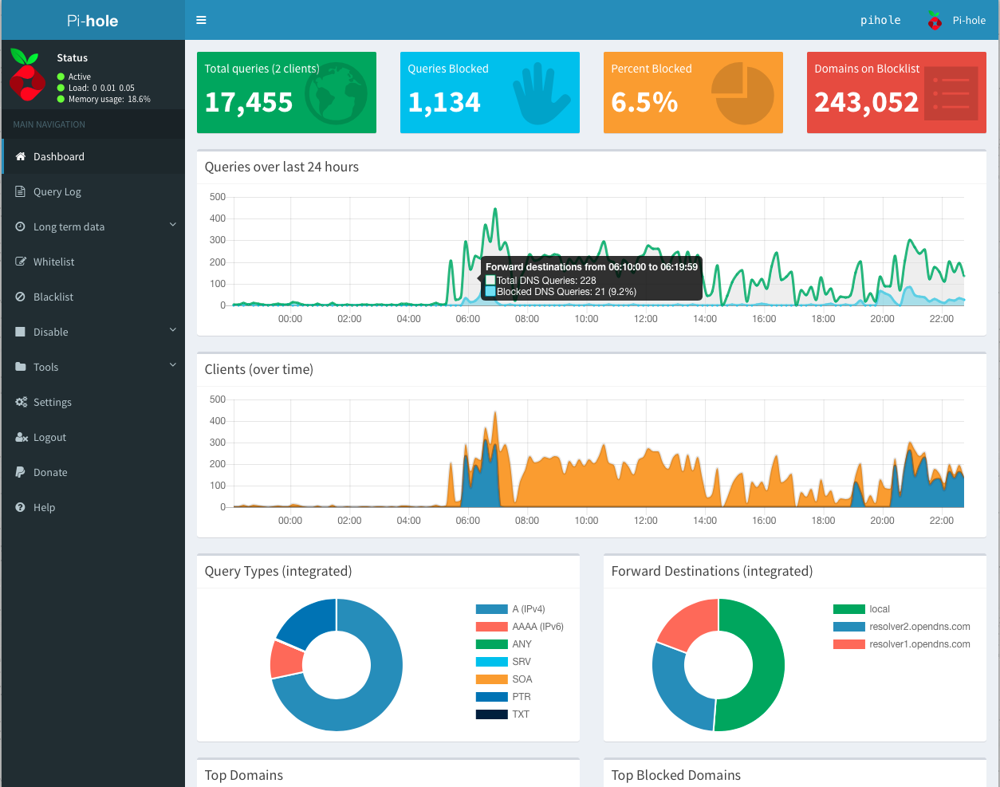

## Pi-Hole

A black hole for Internet advertisements. Network-wide (DNS-based) Ad Blocking.

### Installation

```plain
curl -sSL https://install.pi-hole.net | bash
```

### Usage

```plain
pihole [options]
```

### Flags

```plain
Add '-h' after specific commands for more information on usage

Whitelist/Blacklist Options:
  -w, whitelist       Whitelist domain(s)
  -b, blacklist       Blacklist domain(s)
  --wild, wildcard     Wildcard blacklist domain(s)
  --regex, regex       Regex blacklist domains(s)
                        Add '-h' for more info on whitelist/blacklist usage

Debugging Options:
  -d, debug           Start a debugging session
                        Add '-a' to enable automated debugging
  -f, flush           Flush the Pi-hole log
  -r, reconfigure     Reconfigure or Repair Pi-hole subsystems
  -t, tail            View the live output of the Pi-hole log

Options:
  -a, admin           Web interface options
                        Add '-h' for more info on Web Interface usage
  -c, chronometer     Calculates stats and displays to an LCD
                        Add '-h' for more info on chronometer usage
  -g, updateGravity   Update the list of ad-serving domains
  -h, --help, help    Show this help dialog
  -l, logging         Specify whether the Pi-hole log should be used
                        Add '-h' for more info on logging usage
  -q, query           Query the adlists for a specified domain
                        Add '-h' for more info on query usage
  -up, updatePihole   Update Pi-hole subsystems
                        Add '--check-only' to exit script before update is performed.
  -v, version         Show installed versions of Pi-hole, Web Interface & FTL
                        Add '-h' for more info on version usage
  uninstall           Uninstall Pi-hole from your system
  status              Display the running status of Pi-hole subsystems
  enable              Enable Pi-hole subsystems
  disable             Disable Pi-hole subsystems
                        Add '-h' for more info on disable usage
  restartdns          Restart Pi-hole subsystems
  checkout            Switch Pi-hole subsystems to a different Github branch
                        Add '-h' for more info on checkout usage
```

### Examples

#### Change Admin interface options

```plain
$ pihole -a -h

Set options for the Admin Console
Options:
  -p, password        Set Admin Console password
  -c, celsius         Set Celsius as preferred temperature unit
  -f, fahrenheit      Set Fahrenheit as preferred temperature unit
  -k, kelvin          Set Kelvin as preferred temperature unit
  -r, hostrecord      Add a name to the DNS associated to an IPv4/IPv6 address
  -e, email           Set an administrative contact address for the Block Page
  -h, --help          Show this help dialog
  -i, interface       Specify dnsmasq's interface listening behavior
  -l, privacylevel    Set privacy level (0 = lowest, 4 = highest)
```

#### Pi-Hole Chronometer

```plain
$ pihole -c

|¯¯¯(¯)_|¯|_  ___|¯|___        Core: v4.4
| ¯_/¯|_| ' \/ _ \ / -_)        Web: v4.3.3
|_| |_| |_||_\___/_\___|        FTL: v4.3.1

  Hostname: pihole             (Ubuntu Beaver 18.04)
    Uptime: 00:02:28
 Task Load: 0.12 0.14 0.06     (Active: 1 of 40 tasks)
 CPU usage: 1%                 (2x 3.2 GHz)
 RAM usage: 18%                (Used: 348 MB of 2 GB)
 HDD usage: 6%                 (Used: 2 GB of 47 GB)
  LAN addr: 10.10.10.3         (Gateway: 10.10.10.1)
   Pi-hole: Active             (Blocking: 145063 sites)
 Ads Today: 0%                 (Total: 0 of 1207)
Local Qrys: 11%                (2 DNS servers)
   Blocked:
Top Advert:
Top Domain: raw.githubusercontent.com
Top Client: 10.10.10.40
```



### URL list

* [Pi-hole.net](https://pi-hole.net/)
* [GitHub.com - Pi-Hole](https://github.com/pi-hole/pi-hole)
