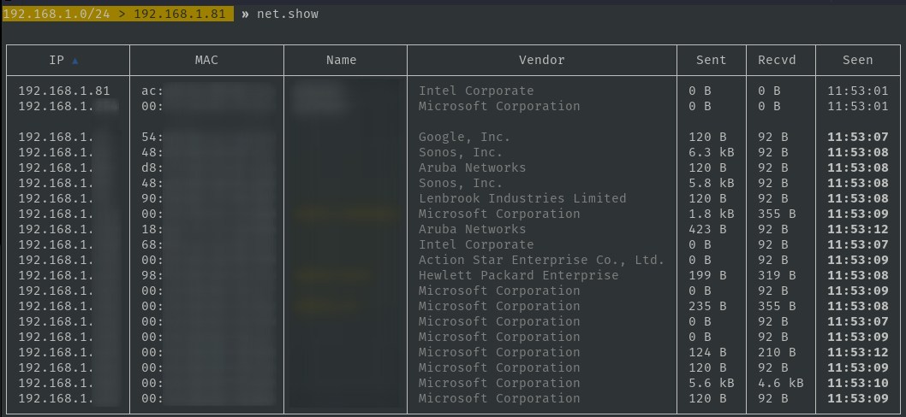
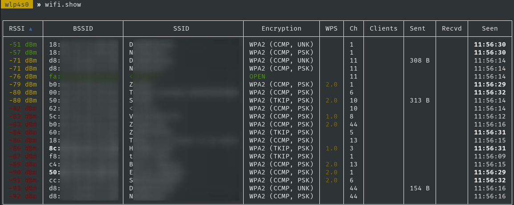

## Bettercap

The Swiss Army knife for WiFi, Bluetooth Low Energy, wireless HID hijacking and Ethernet networks reconnaissance and MITM attacks.

### Installation

Download newest release from [Github.com](https://github.com/bettercap/bettercap/releases)

Install requirements

```plain
sudo apt update && sudo apt install build-essential libpcap-dev net-tools libnetfilter-queue-dev
```

Unzip newest release and move to

```plain
sudo cp bettercap /usr/local/bin
```

Install caplet updates and UI, default credentials user:pass

```plain
sudo bettercap -eval "caplets.update; ui.update; quit"
```

### Usage

```plain
sudo bettercap [OPTIONS]
```

### Flags

```plain
Usage of bettercap:
  -autostart string
        Comma separated list of modules to auto start. (default "events.stream")
  -caplet string
        Read commands from this file and execute them in the interactive session.
  -cpu-profile file
        Write cpu profile file.
  -debug
        Print debug messages.
  -env-file string
        Load environment variables from this file if found, set to empty to disable environment persistence.
  -eval string
        Run one or more commands separated by ; in the interactive session, used to set variables via command line.
  -gateway-override string
        Use the provided IP address instead of the default gateway. If not specified or invalid, the default gateway will be used.
  -iface string
        Network interface to bind to, if empty the default interface will be auto selected.
  -mem-profile file
        Write memory profile to file.
  -no-colors
        Disable output color effects.
  -no-history
        Disable interactive session history file.
  -silent
        Suppress all logs which are not errors.
  -version
        Print the version and exit.
```

### Examples

#### Start on active network interface

```plain
sudo bettercap
```

#### Start on specific network interface

```plain
sudo bettercap -iface <interface>
```

#### ARP spoofing

```plain
sudo bettercap 
» set arp.spoof.targets 10.10.10.10
10.10.10.0/24 > 10.10.10.10  » set arp.spoof.fullduplex true
10.10.10.0/24 > 10.10.10.10  » arp.spoof on
10.10.10.0/24 > 10.10.10.10  » [14:15:03] [sys.log] [inf] arp.spoof arp spoofer started, probing 2 targets.
10.10.10.0/24 > 10.10.10.10  » [14:15:03] [sys.log] [war] arp.spoof full duplex spoofing enabled, if the router has ARP spoofing mechanisms, the attack will fail.
10.10.10.0/24 > 10.10.10.10  » net.sniff on
10.10.10.0/24 > 10.10.10.10  » [14:15:14] [net.sniff.dns] dns 10.10.10.10 > test.example.com. : example.com is 10.10.10.10
10.10.10.0/24 > 10.10.10.10  » [14:15:18] [net.sniff.dns] dns 10.10.10.10 > test.example.com. : abc.cloudapp.azure.com is 52.114.120.4
```

#### Use caplets

```plain
sudo bettercap -caplet http-ui
```

#### Local network recon

```plain
sudo bettercap
```



#### Wi-Fi network recon

```plain
sudo bettercap -iface <wifi-interface>
```



### Troubleshooting

#### libpcap not found

```plain
sudo ln -s /usr/lib/x86_64-linux-gnu/libpcap.so /usr/lib/x86_64-linux-gnu/libpcap.so.1
```

#### Kali web-ui 404-error

```plain
bettercap
ui.update
cp -r /usr/local/share/bettercap/ui/ /usr/share/bettercap/ui/
```

#### Kali web-ui 404-error Raspberry Pi

```plain
Download newest release: https://github.com/bettercap/ui/releases
unzip ui.zip -d /usr/share/bettercap/
```

#### Filter IP's from Bettercap output

```plain
grep -oE "\b([0-9]{1,3}\.){3}[0-9]{1,3}\b" bettercap.log | sort -u > ip.txt
```

### URL list

* [Bettercap.org](https://www.bettercap.org/)
* [GitHub.com - Bettercap](https://github.com/bettercap/bettercap/)
